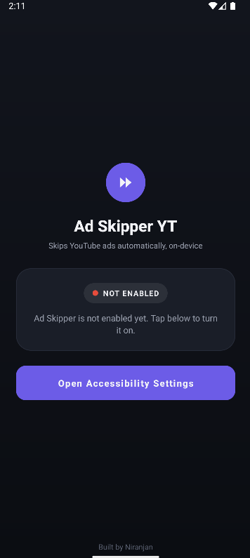
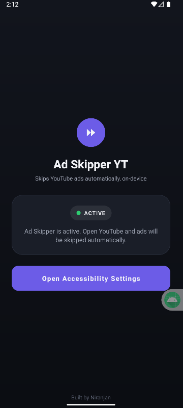

# Ad Skipper YT

Automatically skips YouTube ads on Android using an **Accessibility Service** — no root, no APK modification, no network interception. It detects the native "Skip Ad" button and taps it, the same way a human would.

## Screenshots

| Home screen                              | Enabled state                                 |
|------------------------------------------|-----------------------------------------------|
|  |  |

## How it works

1. An `AccessibilityService` watches the YouTube app's screen only (scoped via `android:packageNames` in the service config — no other app is touched).
2. When the view tree changes, it searches for a node matching known "Skip Ad" label variants.
3. It walks up to the nearest clickable ancestor (the text node itself usually isn't the tappable target) and performs `ACTION_CLICK`.
4. A short cooldown after each successful click prevents redundant repeat clicks during the button's dismiss animation.

No network traffic is read or modified. No data leaves the device.

## Features

- One-tap setup — deep links straight to Android's Accessibility Settings
- Live status indicator (active / not enabled) on the home screen
- Debounced click logic to avoid duplicate taps per ad
- Dark, minimal UI

## Tech stack

- Java
- Android `AccessibilityService` API
- Android Studio / Gradle

## Setup

1. Clone the repo
2. Open in Android Studio
3. Run on a device or emulator with the Play Store image (needed for real YouTube)
4. Open the app → tap **Open Accessibility Settings** → enable **Ad Skipper YT Service**
5. Open YouTube and play any video with a skippable ad

### Android 13+ note
If the toggle is greyed out, go to **Settings > Apps > Ad Skipper YT > 3-dot menu > Allow restricted settings**, then retry.

## Limitations

- Only works on ads with a visible skip button — cannot remove unskippable ads
- Relies on matching the button's text label, so a YouTube UI change could require an update
- Not distributed via Play Store; using it may be inconsistent with YouTube's Terms of Service even though the technique itself only uses Android's public Accessibility API

## License

MIT — do whatever you want with it, just don't blame me if YouTube changes its UI and it stops working.

---

Built by Niranjan